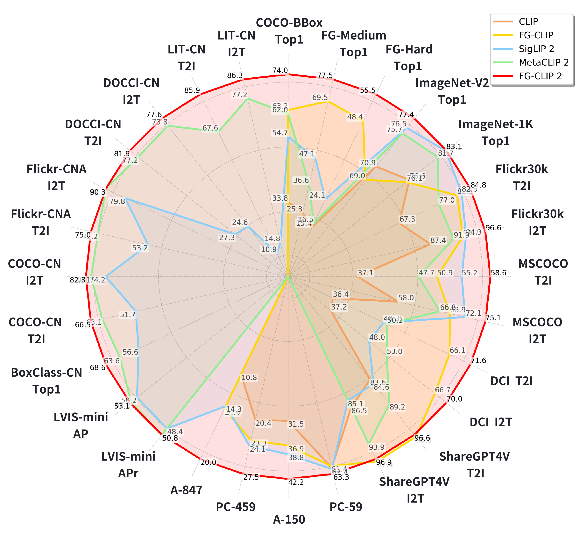
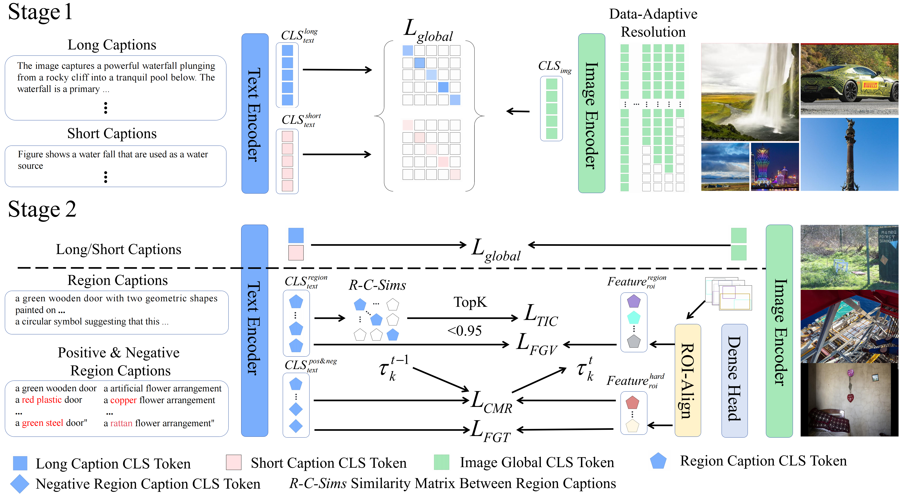

[**中文说明**](README.md) | [**English**](README_en.md)

# FG-CLIP 2: 中英双语视觉语言对齐模型

本仓库是FG-CLIP及FG-CLIP 2的官方实现版本，作为新一代文本-图像跨模态模型，在细粒度理解方面表现卓越。FG-CLIP 2 支持中英双语，在 29 个数据集和 8 类多样化任务中，该模型超越包括SigLIP 2 和 MetaCLIP 2在内的强力基线模型，在两种语言任务中均取得目前的最佳性能。

**[FG-CLIP 2: A Bilingual Fine-grained Vision-language Alignment Model](https://arxiv.org/abs/2510.10921)** 
</br>
Chunyu Xie*, Bin Wang*, Fanjing Kong, Jincheng Li, Dawei Liang, Ji Ao, Dawei Leng†, Yuhui Yin (*Equal Contribution, ✝Corresponding Author)
</br>
[](https://arxiv.org/abs/2510.10921)
[](https://huggingface.co/collections/qihoo360/fg-clip-2-68ecbf9c548623bb78bc7913)
[](https://huggingface.co/collections/qihoo360/fg-clip-2-68ecbf9c548623bb78bc7913)
[](https://research.360.cn/sass/index)

**[FG-CLIP: Fine-Grained Visual and Textual Alignment](https://arxiv.org/abs/2505.05071)** ([code branch: v1.0](https://github.com/360CVGroup/FG-CLIP/tree/v1.0))
</br>
Chunyu Xie*, Bin Wang*, Fanjing Kong, Jincheng Li, Dawei Liang, Gengshen Zhang, Dawei Leng†, Yuhui Yin (*Equal Contribution, ✝Corresponding Author)
</br>
[](https://arxiv.org/abs/2505.05071)
[](https://icml.cc/Conferences/2025)
[](https://huggingface.co/collections/qihoo360/fg-clip-681da45d4acfb65c240a6d08)
[](https://huggingface.co/datasets/qihoo360/FineHARD)
[![DeepWiki](https://img.shields.io/badge/DeepWiki-FG--CLIP-blue.svg?logo=data:image/png;base64,iVBORw0KGgoAAAANSUhEUgAAACwAAAAyCAYAAAAnWDnqAAAAAXNSR0IArs4c6QAAA05JREFUaEPtmUtyEzEQhtWTQyQLHNak2AB7ZnyXZMEjXMGeK/AIi+QuHrMnbChYY7MIh8g01fJoopFb0uhhEqqcbWTp06/uv1saEDv4O3n3dV60RfP947Mm9/SQc0ICFQgzfc4CYZoTPAswgSJCCUJUnAAoRHOAUOcATwbmVLWdGoH//PB8mnKqScAhsD0kYP3j/Yt5LPQe2KvcXmGvRHcDnpxfL2zOYJ1mFwrryWTz0advv1Ut4CJgf5uhDuDj5eUcAUoahrdY/56ebRWeraTjMt/00Sh3UDtjgHtQNHwcRGOC98BJEAEymycmYcWwOprTgcB6VZ5JK5TAJ+fXGLBm3FDAmn6oPPjR4rKCAoJCal2eAiQp2x0vxTPB3ALO2CRkwmDy5WohzBDwSEFKRwPbknEggCPB/imwrycgxX2NzoMCHhPkDwqYMr9tRcP5qNrMZHkVnOjRMWwLCcr8ohBVb1OMjxLwGCvjTikrsBOiA6fNyCrm8V1rP93iVPpwaE+gO0SsWmPiXB+jikdf6SizrT5qKasx5j8ABbHpFTx+vFXp9EnYQmLx02h1QTTrl6eDqxLnGjporxl3NL3agEvXdT0WmEost648sQOYAeJS9Q7bfUVoMGnjo4AZdUMQku50McDcMWcBPvr0SzbTAFDfvJqwLzgxwATnCgnp4wDl6Aa+Ax283gghmj+vj7feE2KBBRMW3FzOpLOADl0Isb5587h/U4gGvkt5v60Z1VLG8BhYjbzRwyQZemwAd6cCR5/XFWLYZRIMpX39AR0tjaGGiGzLVyhse5C9RKC6ai42ppWPKiBagOvaYk8lO7DajerabOZP46Lby5wKjw1HCRx7p9sVMOWGzb/vA1hwiWc6jm3MvQDTogQkiqIhJV0nBQBTU+3okKCFDy9WwferkHjtxib7t3xIUQtHxnIwtx4mpg26/HfwVNVDb4oI9RHmx5WGelRVlrtiw43zboCLaxv46AZeB3IlTkwouebTr1y2NjSpHz68WNFjHvupy3q8TFn3Hos2IAk4Ju5dCo8B3wP7VPr/FGaKiG+T+v+TQqIrOqMTL1VdWV1DdmcbO8KXBz6esmYWYKPwDL5b5FA1a0hwapHiom0r/cKaoqr+27/XcrS5UwSMbQAAAABJRU5ErkJggg==)](https://deepwiki.com/360CVGroup/FG-CLIP)

 <p align="center">
  
</p>

## 🔥 新闻
- 🚀 **[2025/10/14]** 我们已上传FG-CLIP 2代码和模型权重
- 🚀 **[2025/10/14]** 我们发布了论文 [FG-CLIP 2: A Bilingual Fine-grained Vision-language Alignment Model](https://arxiv.org/abs/2510.10921)
- 🚀 **[2025/09/29]** 我们刚刚开源了FG-CLIP的MCP服务器实现, 更多细节请点击 [FGCLIP-MCP](https://github.com/360CVGroup/FGCLIP-MCP)
- 🚀 **[2025/07/29]** 我们提供FG-CLIP 2 base模型的API访问，该模型在性能上显著优于FG-CLIP, 更多细节请查看 [research.360.cn](https://research.360.cn/sass/index)
- 🚀 **[2025/07/09]** 我们创建了两个演示demo，分别针对 [fine-grained retrieval](https://huggingface.co/spaces/qihoo360/FG-CLIP-Retrieval-demo) 和 [dense feature display](https://huggingface.co/spaces/qihoo360/FG-CLIP-Densefeature-demo)
- 🚀 **[2025/05/09]** 我们已将模型上传到 🤗(https://huggingface.co/qihoo360/fg-clip-large)，可以支持快捷使用！
- 🚀 **[2025/05/09]** 我们已更新FG-CLIP github仓库，现在您可以测试我们的模型了！
- 🚀 **[2025/05/09]** 我们发布了论文 [FG-CLIP: Fine-Grained Visual and Textual Alignment](https://arxiv.org/abs/2505.05071).
- 🚀 **[2025/05/02]** FG-CLIP被ICML'25会议接收。


<!-- ## Overview


Fine-grained vision-language understanding requires precise alignment between visual content and linguistic descriptions, a capability that remains limited in current models, particularly in non-English settings. While models like CLIP perform well on global alignment, they often struggle to capture fine-grained details in object attributes, spatial relations, and linguistic expressions, with limited support for bilingual comprehension. To address these challenges, we introduce FG-CLIP 2, a bilingual vision-language model designed to advance fine-grained alignment for both English and Chinese. The key ingredients of FG-CLIP 2 are summarized below.

- Rich Fine-Grained Supervision. Including region-text matching and long-caption modeling, alongside multiple discriminative objectives. We further introduce the Textual Intra-modal Contrastive (TIC) loss to better distinguish semantically similar captions.
- Bilingual Multimodal Data. Trained on a carefully curated mixture of large-scale English and Chinese data, FG-CLIP 2 achieves powerful bilingual performance.
- Performance. Extensive experiments on 29 datasets across 8 tasks show that FG-CLIP 2 outperforms existing methods, achieving state-of-the-art results in both languages.
- Chinese Multimodal Benchmark. To enable rigorous evaluation, we present a new benchmark for Chinese multimodal understanding, featuring long-caption retrieval and bounding box classification. -->


<!-- ## Model Performance -->
<!-- ### Long/short caption image-text retrieval, and zero-shot image classification..  -->


## Contents
- [模型架构](#模型架构)
- [安装](#安装)
- [模型仓库](#模型仓库)
- [快速开始](#快速开始)
- [训练](#训练)
- [评测](#评测)


## 模型架构

我们的方法采用一个两阶段分层学习框架，从全局语义到细粒度细节，逐步增强视觉-语言对齐能力。

**第一阶段：全局语义对齐**  
我们从大规模图像-文本对开始，每对数据均包含一个**短文本描述**（用于简洁的场景级描述）和一个**长文本描述**（用于丰富的上下文细节）。在此双语语料库上进行训练，可实现强大的全局对齐，为英文和中文的跨模态理解奠定坚实基础。

**第二阶段：细粒度视觉-语言学习**  
在全局对齐表示的基础上，我们引入区域级监督信号和多种细粒度目标，以强化局部对应关系。具体包括：

- **细粒度视觉学习**：通过 RoIAlign 提取的区域特征与短语级描述进行区域-文本对齐。
- **细粒度文本学习**：利用属性扰动生成的 hard negative 样本，区分细微的文本差异。
- **带全局阈值同步的跨模态排序损失**：采用动态边距的排序损失，并通过全局同步的阈值实现稳定的 hard negative 挖掘。
- **文本模态内对比损失**：在单一语言内部进行对比学习，以区分语义相近但不同的区域描述。

<p align="center">
  
</p>

## 安装

```shell
conda create -n FGCLIP2 python=3.10 -y
conda activate FGCLIP2
cd FG-CLIP && pip install -e .
```

## 模型仓库


|模型 |           视觉编码器           |                       模型权重                     |                           演示界面                           |
|:-----------|:-----------------------:|:---------------------------------------------------------:|:--------------------------------------------------------:|
| FG-CLIP-Base   | vit-base-patch16-224 | [🤗Huggingface](https://huggingface.co/qihoo360/fg-clip-base)  | [Retrieval](https://huggingface.co/spaces/qihoo360/FG-CLIP-Retrieval-demo) & [Dense Feature](https://huggingface.co/spaces/qihoo360/FG-CLIP-Densefeature-demo) |
|  FG-CLIP-Large   | vit-large-patch14-336 | 🤗[Huggingface](https://huggingface.co/qihoo360/fg-clip-large)  |  |
| FG-CLIP2-Base   | vit-base-patch16 | [🤗Huggingface](https://huggingface.co/qihoo360/fg-clip2-base)  | [Retrieval](https://huggingface.co/spaces/qihoo360/FG-CLIP2-Retrieval-demo) & [Dense Feature](https://huggingface.co/spaces/qihoo360/FG-CLIP2-Densefeature-demo) |
|  FG-CLIP2-Large   | vit-large-patch16 | [🤗Huggingface](https://huggingface.co/qihoo360/fg-clip2-large)  |  |
|  FG-CLIP2-So400m   | vit-so400m-patch16 | [🤗Huggingface](https://huggingface.co/qihoo360/fg-clip2-so400m)  |  |

## 评测基准

|数据集 |          链接          | 
|:-----------|:-----------------------:|
| LIT-CN   | [🤗https://huggingface.co/datasets/qihoo360/LIT-CN](https://huggingface.co/datasets/qihoo360/LIT-CN)  | 
|  DCI-CN   |  🤗[https://huggingface.co/datasets/qihoo360/DCI-CN](https://huggingface.co/datasets/qihoo360/DCI-CN)  | 
| DOCCI-CN   |  [🤗https://huggingface.co/datasets/qihoo360/DOCCI-CN](https://huggingface.co/datasets/qihoo360/DOCCI-CN)  |
|  BoxClass-CN   |  [🤗https://huggingface.co/datasets/qihoo360/BoxClass-CN](https://huggingface.co/datasets/qihoo360/BoxClass-CN)  | 

## 快速开始 🤗

### 加载模型
```Shell
import torch
from PIL import Image
from transformers import (
    AutoImageProcessor,
    AutoTokenizer,
    AutoModelForCausalLM,
)


model_root = "fgclip2-base-patch16"
model = AutoModelForCausalLM.from_pretrained(model_root,trust_remote_code=True).cuda()

device = model.device

tokenizer = AutoTokenizer.from_pretrained(model_root)
image_processor = AutoImageProcessor.from_pretrained(model_root)

```


### 检索

```Shell
def determine_max_value(image):
    w,h = image.size
    max_val = (w//16)*(h//16)
    if max_val > 784:
        return 1024
    elif max_val > 576:
        return 784
    elif max_val > 256:
        return 576
    elif max_val > 128:
        return 256
    else:
        return 128

img_root = "cat_dfclor.jpg"
image = Image.open(img_root).convert("RGB")

image_input = image_processor(images=image, max_num_patches=determine_max_value(image), return_tensors="pt").to(device)

# NOTE Short captions: max_length=64 walk_type="short"(default)
# NOTE Long captions: max_length=196 walk_type="long"

captions = [
"一个简约风格的卧室角落，黑色金属衣架上挂着多件米色和白色的衣物，下方架子放着两双浅色鞋子，旁边是一盆绿植，左侧可见一张铺有白色床单和灰色枕头的床。",
"一个简约风格的卧室角落，黑色金属衣架上挂着多件红色和蓝色的衣物，下方架子放着两双黑色高跟鞋，旁边是一盆绿植，左侧可见一张铺有白色床单和灰色枕头的床。",
"一个简约风格的卧室角落，黑色金属衣架上挂着多件米色和白色的衣物，下方架子放着两双运动鞋，旁边是一盆仙人掌，左侧可见一张铺有白色床单和灰色枕头的床。",
"一个繁忙的街头市场，摊位上摆满水果，背景是高楼大厦，人们在喧闹中购物。"
]
captions = [caption.lower() for caption in captions]

caption_input = tokenizer(captions, padding="max_length", max_length=196, truncation=True, return_tensors="pt").to(device)


with torch.no_grad():
  image_feature = model.get_image_features(**image_input)
  text_feature = model.get_text_features(**caption_input,walk_type="long")
  image_feature = image_feature / image_feature.norm(p=2, dim=-1, keepdim=True)
  text_feature = text_feature / text_feature.norm(p=2, dim=-1, keepdim=True)

logits_per_image = image_feature @ text_feature.T
logit_scale, logit_bias = model.logit_scale.to(text_feature.device), model.logit_bias.to(text_feature.device)
logits_per_image = logits_per_image * logit_scale.exp() + logit_bias
```
 <p align="left">
  
</p>

### 密集特征效果展示

```Shell

import math
import matplotlib
matplotlib.use('Agg') 
import matplotlib.pyplot as plt

def resize_short_edge(image, target_size=2048):
    if isinstance(image, str):
        image = Image.open(image)
    width, height = image.size
    short_edge = min(width, height)

    if short_edge >= target_size:
        return image
    scale = target_size / short_edge
    new_width = int(width * scale)
    new_height = int(height * scale)
    resized_image = image.resize((new_width, new_height))
    return resized_image


img_root = "cat_dfclor.jpg"
image = Image.open(img_root).convert("RGB")
image = resize_short_edge(image,target_size=2048)

image_input = image_processor(images=image, max_num_patches=16384, return_tensors="pt").to(device)
captions = ["电脑","黑猫","窗户","window","white cat","book"]

with torch.no_grad():
    dense_image_feature = model.get_image_dense_feature(**image_input)
    
    spatial_values = image_input["spatial_shapes"][0]
    real_h = spatial_values[0].item()
    real_w = spatial_values[1].item()
    real_pixel_tokens_num = real_w*real_h
    dense_image_feature = dense_image_feature[0][:real_pixel_tokens_num]
    captions = [caption.lower() for caption in captions]
    caption_input = tokenizer(captions, padding="max_length", max_length=64, truncation=True, return_tensors="pt").to(device)

    text_feature = model.get_text_features(**caption_input, walk_type="box")
    text_feature = text_feature / text_feature.norm(p=2, dim=-1, keepdim=True)
    dense_image_feature = dense_image_feature / dense_image_feature.norm(p=2, dim=-1, keepdim=True)

similarity = dense_image_feature @ text_feature.T
similarity = similarity.cpu()


num_classes = len(captions)
cols = 3
rows = (num_classes + cols - 1) // cols


aspect_ratio = real_w / real_h 

fig_width_inch = 3 * cols        
fig_height_inch = fig_width_inch / aspect_ratio * rows / cols  

fig, axes = plt.subplots(rows, cols, figsize=(fig_width_inch, fig_height_inch))
fig.subplots_adjust(wspace=0.01, hspace=0.01)

if num_classes == 1:
    axes = [axes]
else:
    axes = axes.flatten()

for cls_index in range(num_classes):
    similarity_map = similarity[:, cls_index].cpu().numpy()
    show_image = similarity_map.reshape((real_h, real_w))

    ax = axes[cls_index]
    ax.imshow(show_image, cmap='viridis', aspect='equal')  
    ax.set_xticks([])
    ax.set_yticks([])
    ax.axis('off')


for idx in range(num_classes, len(axes)):
    axes[idx].axis('off')

savename = "FGCLIP2_dfcolor_cat_all_2K.png"
plt.savefig(savename, dpi=150, bbox_inches='tight', pad_inches=0.05)
plt.close()
```

 <p align="left">
  
</p>

## 训练

### 数据准备

我们提供使用 [🤗FineHARD dataset](https://huggingface.co/datasets/qihoo360/FineHARD) 进行第二阶段训练的代码。FineHARD 数据集包含1200万张图像、4000万个带有细粒度区域描述的边界框，以及1000万个hard negative样本。

关于数据准备，请参考 [Data: FineHARD](data/data.md)


### 准备训练
我们的训练和推理代码完全基于 Hugging Face 提供的 transformers 仓库，非常易于使用和复现。我们在 scripts 目录中提供了训练脚本。
</br>
[🤗 Transformers: State-of-the-art Machine Learning for Pytorch, TensorFlow, and JAX.](https://github.com/huggingface/transformers)
</br>
我们的训练脚本支持 zero2、tf32 加速和 bf16 精度（注意 fp16 精度可能导致梯度 NAN）。如果您不满足上述条件，请关闭 tf32 并使用 torchrun 替代 deepspeed 启动。
</br>
```Shell
bash scripts/train/stage2_fgclip2.sh
```


## 评测
### 数据准备
从以下链接下载 share-captioner_coco_lcs_sam_1246k_1107.json 
https://huggingface.co/datasets/Lin-Chen/ShareGPT4V/blob/main/share-captioner_coco_lcs_sam_1246k_1107.json

从以下链接下载 CocoCaptions 并放入 data/coco/annotations/

https://github.com/tylin/coco-caption

从以下链接下载 COCO 并放入 data/coco

https://cocodataset.org/dataset

DCI 的描述来自以下链接并放入 data/densely_captioned_images

https://github.com/facebookresearch/DCI

ImageNet-1K 来自以下链接并放入 data/IN1K_val

https://image-net.org/

ImageNet-v2 来自以下链接并放入 data/imagenetv2-matched-frequency-format-val

https://opendatalab.com/OpenDataLab/ImageNetV2/tree/main


```bash
bash scripts/eval/eval.sh
```


<!-- ## Acknowledgement -->
## 招聘中
我们正在招募多模态方向的学术实习生。如有兴趣，请将简历发送至 xiechunyu@360.cn.
## 引用
如果您在研究或应用中发现 FG-CLIP 2 对您有所帮助，请使用以下 BibTeX 引用：

```
@article{xie2025fg2,
  title={FG-CLIP 2: A Bilingual Fine-grained Vision-language Alignment Model},
  author={Xie, Chunyu and Wang, Bin and Kong, Fanjing and Li, Jincheng and Liang, Dawei and Ao, Ji and Leng, Dawei and Yin, Yuhui},
  journal={arXiv preprint arXiv:2510.10921},
  year={2025}
}
```
```
@article{xie2025fg,
  title={FG-CLIP: Fine-Grained Visual and Textual Alignment},
  author={Xie, Chunyu and Wang, Bin and Kong, Fanjing and Li, Jincheng and Liang, Dawei and Zhang, Gengshen and Leng, Dawei and Yin, Yuhui},
  journal={arXiv preprint arXiv:2505.05071},
  year={2025}
}
```
